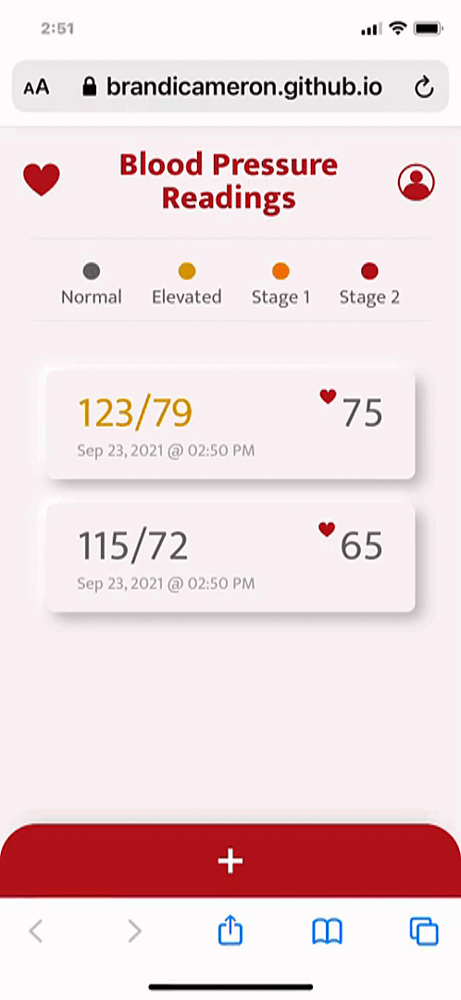

# Blood Pressure Readings Tracker

---

Keep track of your blood pressure and have a quick way to show your doctor your stats! Logs blood pressure and pulse, with automatic date and time stamping. Readings are color coded: Normal, elevated, hypertension stage 1, hypertension stage 2 and hypertension crisis.

TRY IT HERE: [https://brandicameron.github.io/bp/](https://brandicameron.github.io/bp/) (Guest login available!)

---

## Description

---

I learned soooooooo many fun things coding out this little card game:

- The fisher-yates shuffle algorithm.
- Local Storage
- Javascript Modules
- Javascript Classes
- Using setTimeout.
- How to prevent event bubbling.
- How to make an accessible styled toggle button that can be tabbed to.
- Built my first testing function.

---

## Credits

---

Logo was created in Illustrator using monster vector graphics from [www.freepick.com](https://www.freepik.com/free-vector/monster-character-set_1538770.htm#page=1&query=monsters&position=28)

--------------------------------

Discovered the fisher-yates shuffle from this [stackoverflow](https://stackoverflow.com/questions/2450954/how-to-randomize-shuffle-a-javascript-array) post, which has been useful in other projects as well. (check out this [US Map Quiz](https://brandicameron.github.io/us-map-quiz/)!) 😃
